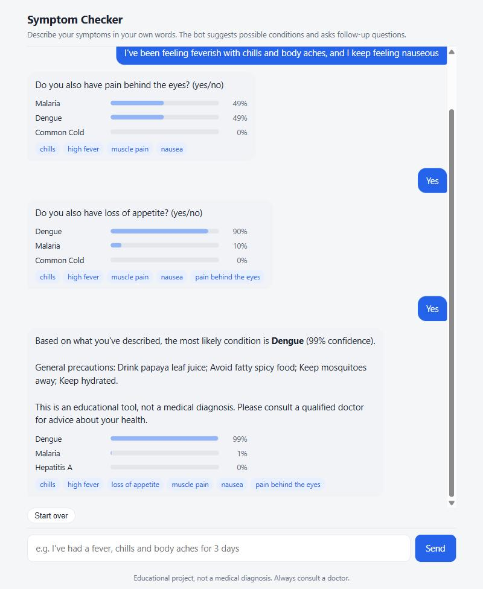
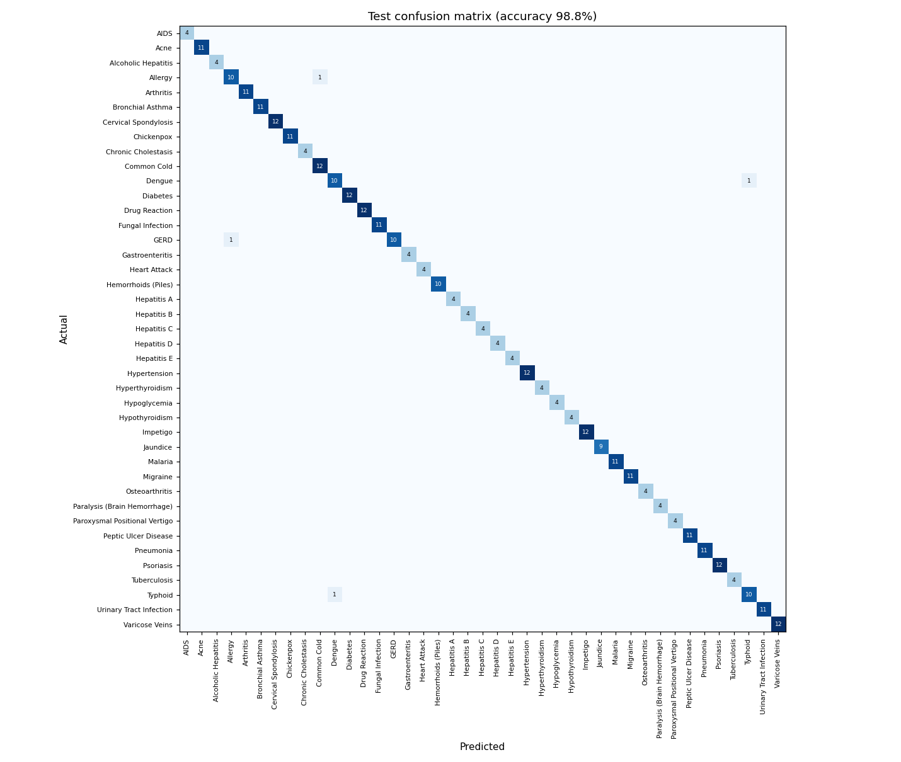

# Disease Prediction Chatbot

An NLP chatbot that predicts likely diseases from symptoms described in plain English. 

**Live demo: [harsh-symptom-checker.vercel.app](https://harsh-symptom-checker.vercel.app)**. The model runs entirely in your browser. It normalises everyday phrases ("throwing up", "tummy ache", "can't breathe") to medical symptom terms, classifies the text with TF-IDF and a calibrated LinearSVC, and asks follow-up questions when it is unsure. It runs as a FastAPI service with a web chat UI and ships with a Dockerfile.

**Tech stack:** Python · scikit-learn · NLTK · FastAPI · Docker



## Results

Test split: 337 held-out messages across **41 disease categories**. Model and threshold choices were made on a separate validation split. Full numbers are in [`reports/`](reports).

| Test set | What it measures | Accuracy |
|---|---|---|
| **All test messages** (337) | overall | **98.8%** (macro-F1 0.991) |
| Natural language (173) | real patient-style descriptions, 24 diseases | **97.7%** |
| Structured (82) | symptom combinations never seen in training, written with unseen sentence templates | 100% |
| Lay language (82) | the same combinations written with lay phrases that never appear in the training text | 100% |

- **Stable on unseen inputs:** 5-fold cross-validation on the natural-language descriptions gives **97.5% ± 0.3%**.
- **Faster responses (64% lower latency):** mean per-message inference fell from **5.19 ms to 1.89 ms** (p95 from 5.81 to 2.46 ms) with no change in test accuracy. Two optimisations did this. First, rare n-grams were pruned with `min_df=2`, cutting features from 23,347 to 16,031. Second, the 5-model calibration ensemble was replaced with a single calibrated LinearSVC. See [`reports/latency.json`](reports/latency.json).
- **Symptom normalisation matters for real users:** on the lay-language set, accuracy is 100% with normalisation and 95.1% without it (validation split).
- **Follow-up questions help:** a simulated patient mentions only 2 of their symptoms, then answers the bot's yes/no questions truthfully. Top-1 accuracy rises from **71.7% to 86.8%**, with 1.33 questions per conversation on average. This was run on 205 held-out dialogues ([`reports/dialogue_simulation.json`](reports/dialogue_simulation.json)).

### Model comparison (validation split)

| Model | Accuracy | Macro-F1 | Natural-language acc. |
|---|---|---|---|
| **LinearSVC (C=3)** | **97.9%** | **0.985** | **96.0%** |
| Logistic Regression | 97.6% | 0.983 | 95.4% |
| k-NN (k=5, cosine) | 93.8% | 0.948 | 87.9% |
| Random Forest (300 trees) | 93.2% | 0.926 | 91.3% |
| Complement Naive Bayes | 91.7% | 0.909 | 86.1% |



## Data

| Source | Rows | Notes |
|---|---|---|
| [Symptom2Disease](https://huggingface.co/datasets/NeuronZero/Symptom2Disease) | 1,200 | first-person symptom descriptions, 24 diseases (1,153 after removing duplicate texts) |
| [Kaggle Disease-Symptom-Precaution](https://huggingface.co/datasets/shanover/disease_symptoms_prec_full) | 4,920 | symptom lists + precautions, 41 diseases |

Together these are 6,120 symptom-disease records. Two data-quality issues were handled before any training:

- **Duplicates:** only 304 of the 4,920 Kaggle rows are unique. Splitting before deduplication would put copies of test rows into training and inflate accuracy, so rows are deduplicated first. Each disease's unique symptom combinations are then split into train, validation (1 combination) and test (1 combination).
- **Label names:** the two sources spell the same diseases differently ("Dimorphic hemmorhoids(piles)" vs. "Dimorphic Hemorrhoids", "GERD" vs. "gastroesophageal reflux disease"). These are mapped to one set of 41 labels.

The structured symptom lists are turned into sentences with templates. Training and test use different template sets, and a third of the lay synonyms are held out of training entirely, to build the lay-language test.

> **Limitations.** Both datasets are small and partly synthetic. The structured and lay test sets are template-generated, so real-world accuracy will be lower than the table suggests. The natural-language score is the most realistic number. This is a portfolio project and must not be used for medical decisions.

## How it works

```
"I've been throwing up and I don't have a fever"
        │
        ▼
1. Symptom normalisation   "throwing up" → vomiting,  "fever" → high fever (negated)
2. Tokenise + stem         [..., 'vomit', 'sym_vomiting', 'not_sym_high_fever']
3. TF-IDF (word 1-2 grams + char 3-5 grams, sublinear tf, min_df=2)
4. Calibrated LinearSVC    → probability for each of 41 diseases
5. Dialogue manager        confident?  → answer + precautions
                           unsure?     → ask the most discriminative yes/no question
```

- **Normalisation** ([`lexicon.py`](src/symptom_chatbot/lexicon.py), [`preprocess.py`](src/symptom_chatbot/preprocess.py)) uses 131 canonical symptoms and about 220 lay phrases, matched with a single compiled regex (longest phrase first). Every match becomes a `sym_*` feature. Negation words ("no", "don't", "without") within the same clause produce `not_sym_*`, so "no fever" and "fever" do not look alike to the model.
- **Follow-up questions** ([`chatbot.py`](src/symptom_chatbot/chatbot.py)): the bot asks about the symptom whose frequency varies most across the current top candidates, weighted by their probabilities. Answers are folded in with a naive-Bayes update, P(d | text, answers) ∝ P(d | text) · Π P(answer | d), with each answer capped at a 9× likelihood ratio. The bot stops asking at 90% confidence (tuned on validation dialogues) or after 3 questions.
- **Safety:** every answer carries a disclaimer. Possible heart attack or stroke triggers an emergency warning. Low-confidence results are presented as a list of possibilities rather than a single answer.

## Quick start

```bash
python -m venv .venv
.venv\Scripts\activate            # Linux/macOS: source .venv/bin/activate
pip install -r requirements-dev.txt

uvicorn app.main:app --reload     # open http://localhost:8000
```

The trained model (`models/disease_model.joblib`) is included. Interactive API docs are at `http://localhost:8000/docs`.

```bash
curl -X POST localhost:8000/api/predict -H "Content-Type: application/json" \
     -d '{"text": "burning when I pee, smelly urine and bladder pain"}'
```

```json
{"predictions": [{"disease": "Urinary Tract Infection", "probability": 0.9766}, ...],
 "symptoms_detected": {"burning urination": true, "foul smell of urine": true, "bladder discomfort": true}}
```

| Endpoint | Purpose |
|---|---|
| `POST /api/predict` | one-shot top-k prediction for a text |
| `POST /api/chat` | multi-turn conversation (send back the returned `session_id`) |
| `DELETE /api/chat/{id}` | end a session |
| `GET /health` | liveness check |

### Website (Vercel)

`web/` is a static website that runs the same model **entirely in the browser**, with no server. [`scripts/export_web_model.py`](scripts/export_web_model.py) exports the trained pipeline's vocabularies, IDF weights, SVM coefficients and calibration parameters (about 3 MB). The JavaScript port in [`web/js/`](web/js) reimplements the full pipeline: symptom normalisation, NLTK's Porter stemmer, word and char_wb TF-IDF, LinearSVC, sigmoid calibration and the dialogue manager. In the browser a prediction takes under 1 ms.

The port is verified against Python by [`tests/web_parity.mjs`](tests/web_parity.mjs). It checks 1,649 stems, 344 texts (max probability difference 6e-8, identical top-1) and 13 full conversations.

```bash
python scripts/export_web_model.py   # after retraining
node tests/web_parity.mjs            # parity check
python -m http.server 8100 --directory web
```

**Deploy:** import the GitHub repo in Vercel, set **Root Directory** to `web`, leave Framework Preset as *Other* with no build command, and click Deploy.

### Docker / cloud deployment

```bash
docker build -t symptom-chatbot .
docker run -p 8000:8000 symptom-chatbot
```

The image runs as a non-root user, includes a health check, and reads `PORT` from the environment. That means it can be deployed unchanged to Cloud Run, Render, Railway or similar platforms.

## Reproducing the results

```bash
python scripts/prepare_data.py         # download + clean + split → data/processed/
python scripts/train.py                # model comparison, ablations, final model, test metrics
python scripts/benchmark_latency.py    # baseline vs. optimised response time
python scripts/simulate_dialogue.py    # follow-up question evaluation
python -m pytest tests                 # 14 tests: preprocessing, model, dialogue, API
node tests/web_parity.mjs              # browser port matches Python exactly
```

## Project structure

```
├── web/                         # static website: model runs in the browser (Vercel)
├── app/
│   ├── main.py                  # FastAPI service
│   └── static/index.html        # chat UI
├── src/symptom_chatbot/
│   ├── lexicon.py               # canonical symptoms + lay synonyms
│   ├── preprocess.py            # normalisation, negation, tokenisation
│   ├── data.py                  # load, dedupe, merge, split, templating
│   ├── model.py                 # TF-IDF + calibrated LinearSVC pipeline
│   └── chatbot.py               # dialogue manager + follow-up questions
├── scripts/                     # data prep, training, benchmarks, simulation
├── models/                      # trained pipeline + symptom/precaution knowledge
├── reports/                     # metrics, comparisons, plots
├── tests/
└── Dockerfile
```

## License

Code: [MIT](LICENSE). Datasets keep their original licences.
